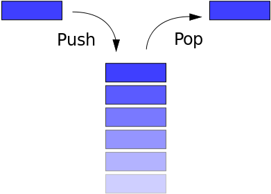

# Stack!

A **stack** is a basic data structure where you can only insert or delete items at the top of the stack. It is kind of similar to a stack of books. If you want to look at a book in the middle of stack you must take all the books above it off first.

The stack is considered **LIFO (Last In First Out)**; meaning the last item you put in the stack is the first item that comes out of the stack.

# Operations on Stack

There are **three** main operations that can be performed on stacks;

 1. Inserting an item (PUSH)
 2. Deleting an Item (POP)
 3. Display contents of Stack (PIP)

# Stack Time Complexity
| Algorithm | Average  | Worst Case|
|--|--|--|
|Space |  O(n) |O(N)|
|Search |  O(n) |O(N)|
|Insert |  O(1) |O(1)|
|Delete |  O(1) |O(1)|
